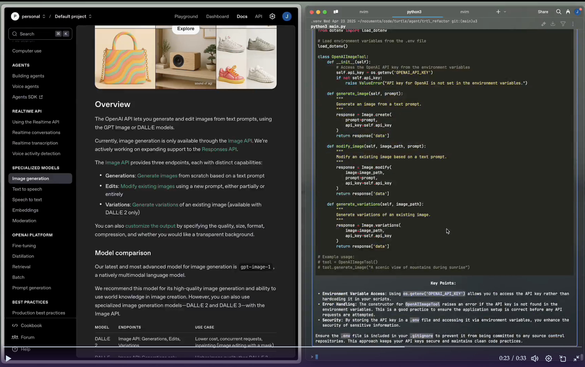

# trtl deamon


A daily driver agent with:
- access to a wide array of command line tools
- ability to search out new tools to accomplish a task
- long term memory about requested, successful executions, and personal prefs

This agent is REDICULOUSLY UNSAFE!!!
Because it can search the internet, download tools, and execute code
arbitrarily, literally anything can happen. There are zero guard rails.
You have been warned. 

Trtl is fairly strong at coding tasks, and is much cheaper than 
something like Claude Code. 
Right now it supports OpenAI models only.
While coding it can edit files directly, which 
should show in whatever editor you are using. 

## Demo's
Learn about things trtl can do on its twitter page: https://x.com/trtldaemon 


## CLI tool installation

grant permissions to run these scripts
navigate to `bin/` in the project root

```bash
chmod +x install.sh
chmod +x update.sh
chmod +x uninstall.sh
```

then run when needed

```bash
sudo ./install.sh
sudo ./update.sh
sudo ./uninstall.sh
```

## python setup

create env

```bash
python3 -m venv .venv
source .venv/bin/activate
pip install -r requirements.txt
```

now you are running in the virtual env

```bash
pip freeze > requirements.txt
```

when you need to add more deps

```bash
deactivate
```

when finished

## environment

in project base

```bash
touch .env
```

then open the `.env`
and paste in your API key like this

```text
ANTHROPIC_API_KEY={your api key}
```

running as module with `python3` in project root

```bash
python3 -m trtl.cli
```
