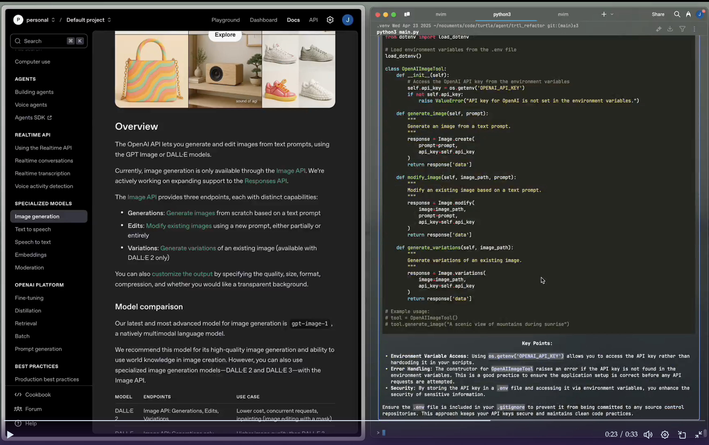

# trtl deamon


A daily driver agent with:

- access to a wide array of command line tools
- ability to search out new tools to accomplish a task
- long term memory about requested, successful executions, and personal prefs

This agent is REDICULOUSLY UNSAFE!!!
Because it can search the internet, download tools, and execute code
arbitrarily, literally anything can happen. There are zero guard rails.
You have been warned.

Trtl is fairly strong at coding tasks, and is much cheaper than
something like Claude Code.
Right now it supports OpenAI models only.
While coding it can edit files directly, which
should show in whatever editor you are using.

## Demo's

Learn about things trtl can do on its twitter page: https://x.com/trtldaemon


## CLI tool installation

first, make an `.env` in this project's root

```bash
touch .env
```

the `.env` should have these entries with your key's pasted in

(soon other search engines and AI providers will be supported)

```bash
OPENAI_API_KEY=xxxxxxxx
TAVILY_API_KEY=xxxxxxxx

```

now install the project globally

```bash
pip install pipx # get pipx
pipx install . --editable # I force install this way in case there is a stale trtl
pipx install --upgrade . # to upgrade globally
```

uninstall

```bash
pipx uninstall trtl
```

if you want to develop against the project locally

```bash
poetry install
poetry run trtl
```
